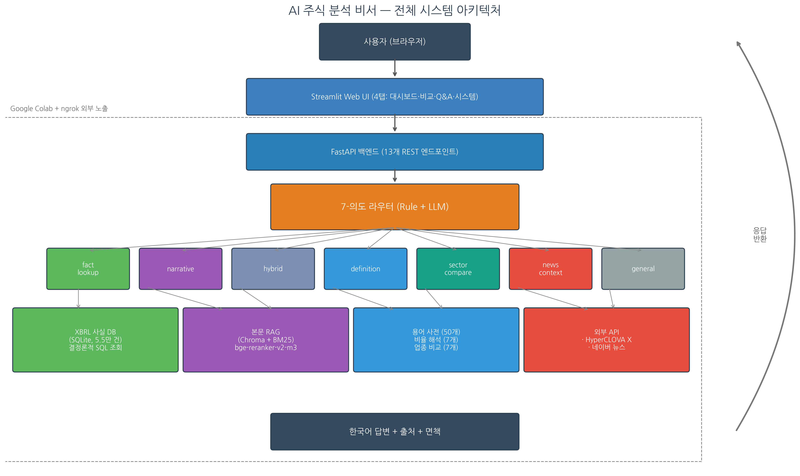

# DART 공시 기반 AI 주식 분석 비서

> **XBRL 메타데이터 활용 사실 DB와 라우팅 RAG 통합**

[](https://www.python.org/)
[](LICENSE)
[](https://streamlit.io/)
[](https://fastapi.tiangolo.com/)

성균관대학교 소프트웨어대학 (2026)

---

## ✨ 결과

| 지표 | 본 시스템 | 베이스라인 A | 베이스라인 B |
|---|---|---|---|
| **정형 수치 정답률** | **96.2%** (25/26) | 3.8% (1/26) | 7.7% (2/26) |
| **응답 시간 (Fact)** | 평균 2.5초 | — | — |
| **응답 시간 (RAG, GPU)** | 약 11초 | — | — |
| **사실 데이터 규모** | 5.5만 건 | 13K 청크 | 13K 청크 |

→ **단순 본문 RAG 베이스라인 대비 12-25배 성능 향상**

추가로:
- 데이터 규모를 2.8만→5.5만으로 두 배 확장 후에도 정답률 동일 유지 (견고성 입증)
- 50개 금융 용어 사전, 7개 재무 비율 자동 해석, 7개 업종 비교 통합
- 실시간 뉴스 통합 (네이버 검색 API), 챗봇 메모리, PDF 보고서 자동 생성

## 시연

**라이브 데모**: Colab 실행 시 ngrok URL로 접속 가능

**영상**: [](https://youtu.be/plB2DTC8NpM)

## 핵심 발견

```
제안서      : 일반 RAG로 충분할 것이라 가정
중간보고서  : 텍스트 RAG의 손실 압축 한계 규명
              → Vision-RAG로 진행 예정
최종보고서  : 도메인 메타데이터(XBRL)가 더 나은 답
              → 96.2%, 베이스라인 대비 12-25배
```

> **시사점**: 도메인 표준이 존재하는 영역에서는
> 멀티모달 LLM 도입 전 도메인 메타데이터 활용을 우선 검토해야 함

## 시스템 아키텍처



사용자의 자연어 질문 → **7-의도 라우터** → 의도별 핸들러 → 답변 생성

| 의도 | 예시 | 처리 경로 |
|---|---|---|
| `fact_lookup` | 삼성전자 2025년 매출은? | XBRL 사실 DB → SQL 조회 |
| `narrative` | 삼성전자 사업 부문은? | 본문 RAG → LLM 요약 |
| `hybrid` | 현대차 매출과 사업 동향은? | 사실 DB + RAG 결합 |
| `definition` | PER이 뭐야? | 50개 금융 용어 사전 |
| `sector_compare` | 반도체 업종 비교 | 업종 분석 모듈 |
| `news_context` | 삼성전자 최근 동향 | 네이버 뉴스 + 사실 DB + LLM |
| `general` | 주식 처음 시작 방법 | LLM 일반 답변 (주의문 부착) |


본 시스템은 **Google Colab 실행을 기준**으로 개발되었으며, 모든 모듈은 평면 구조에서 동작하도록 작성되어 있습니다. 즉 `src/` 안의 모든 `.py` 파일은 같은 디렉토리 (`/content/src/`)에 배치되어야 import가 정상 작동합니다.

### 옵션 1: Google Colab에서 실행 (권장)

#### 1단계: 저장소 다운로드 + 평면화

```python
# Colab 첫 셀
!git clone https://github.com/yjr2003/AI-Stock-Analysis-Assistant.git /content/repo

# src/ 안의 모든 .py 파일을 /content/src/에 평면화
import os, shutil
os.makedirs('/content/src', exist_ok=True)

for root, dirs, files in os.walk('/content/repo/src'):
    for f in files:
        if f.endswith('.py'):
            shutil.copy(os.path.join(root, f), '/content/src/')

# 데이터 폴더 준비
for d in ['/content/data/raw', '/content/data/processed', '/content/db']:
    os.makedirs(d, exist_ok=True)

# Python 경로 추가
import sys
sys.path.insert(0, '/content/src')

print(" 환경 준비 완료")
print(f"   src 파일: {len(os.listdir('/content/src'))}개")
```

#### 2단계: Colab Secrets에 환경변수 등록

좌측 열쇄 아이콘 클릭 → 다음 키 등록:

| 키 이름 | 용도 | 발급처 |
|---|---|---|
| `DART_API_KEY` | DART 공시 다운로드 | https://opendart.fss.or.kr |
| `OPENAI_API_KEY` | 임베딩 | https://platform.openai.com |
| `CLOVA_API_KEY` | HyperCLOVA X (LLM) | https://www.ncloud.com/product/aiService/clovaStudio |
| `NAVER_CLIENT_ID` | 네이버 뉴스 | https://developers.naver.com |
| `NAVER_CLIENT_SECRET` | 네이버 뉴스 | 동일 |
| `NGROK_AUTHTOKEN` | 외부 노출 | https://ngrok.com |

#### 3단계: 데이터 구축 (1회만 실행)

```python
# Colab Secrets에서 환경변수 로드
from google.colab import userdata
import os

for key in ['DART_API_KEY', 'OPENAI_API_KEY', 'CLOVA_API_KEY',
            'NAVER_CLIENT_ID', 'NAVER_CLIENT_SECRET']:
    os.environ[key] = userdata.get(key)

# 1) DART 보고서 다운로드 (~10-15분)
from data_crawl import crawl_company_reports

TARGET_COMPANIES = {
    '삼성전자': '00126380', 'SK하이닉스': '00164779',
    'LG에너지솔루션': '01566260', '삼성바이오로직스': '00877059',
    '현대자동차': '00164742', '기아': '00106641',
    'NAVER': '00266961', 'POSCO홀딩스': '00434003',
    'LG화학': '00356361', '셀트리온': '00421045',
}

for name, code in TARGET_COMPANIES.items():
    crawl_company_reports(
        corp_code=code, corp_name=name,
        out_dir='/content/data/raw',
        start_date='20231114', end_date='20260430',
    )

# 2) XBRL 파싱 (1-2분)
from preprocessor_v2 import process_all_companies
process_all_companies(
    input_dir='/content/data/raw',
    output_dir='/content/data/processed',
)

# 3) 사실 DB 구축
from build_fact_db import build_fact_db
build_fact_db(
    input_path='/content/data/processed/facts.jsonl',
    output_path='/content/db/facts.db',
)

# 4) RAG 색인 (25-30분, OpenAI 임베딩 호출)
from build_rag_db import build_rag_index
build_rag_index(
    sections_path='/content/data/processed/sections.jsonl',
    output_dir='/content/db/chroma_rag',
    embedding_model='text-embedding-3-small',
)

print(" 모든 데이터 완료")
```

#### 4단계: 웹 애플리케이션 배포 (FastAPI + Streamlit + ngrok)

```python
import os, sys, time, subprocess
from google.colab import userdata
from pyngrok import ngrok

# ngrok 토큰
os.environ['NGROK_AUTHTOKEN'] = userdata.get('NGROK_AUTHTOKEN')
ngrok.set_auth_token(os.environ['NGROK_AUTHTOKEN'])

# FastAPI 백엔드 시작 (포트 8000)
api_proc = subprocess.Popen(
    ['python', '/content/src/api_server.py', '--no-ngrok'],
    stdout=open('/content/api.log', 'w'),
    stderr=subprocess.STDOUT,
    env=os.environ.copy(),
)
time.sleep(8)

# Streamlit 프론트엔드 시작 (포트 8501)
streamlit_env = {**os.environ, 'API_URL': 'http://localhost:8000'}
streamlit_proc = subprocess.Popen(
    ['streamlit', 'run', '/content/src/streamlit_app.py',
     '--server.port=8501', '--server.headless=true',
     '--server.address=0.0.0.0',
     '--server.enableCORS=false',
     '--server.enableXsrfProtection=false'],
    stdout=open('/content/streamlit.log', 'w'),
    stderr=subprocess.STDOUT,
    env=streamlit_env,
    start_new_session=True,
)
time.sleep(15)

# ngrok 터널
public_url = ngrok.connect(8501, 'http')
print(f"\n 외부 접속 URL: {public_url.public_url}")
```

→ ngrok URL을 브라우저에 입력하면 웹 애플리케이션 사용 가능

### 옵션 2: 로컬에서 실행

#### 환경 준비

```bash
# 저장소 클론
git clone https://github.com/yjr2003/AI-Stock-Analysis-Assistant.git
cd AI-Stock-Analysis-Assistant

# src 평면화 (모든 .py를 한 폴더로)
mkdir -p flat_src
find src -name "*.py" -exec cp {} flat_src/ \;
cd flat_src

# 가상환경
python -m venv venv
source venv/bin/activate  # Windows: venv\Scripts\activate

# 의존성
pip install -r ../requirements.txt
```

#### 환경변수 설정

```bash
# .env 파일 또는 export
export DART_API_KEY="..."
export OPENAI_API_KEY="sk-..."
export CLOVA_API_KEY="nv-..."
export NAVER_CLIENT_ID="..."
export NAVER_CLIENT_SECRET="..."
```

#### 데이터 구축 + 실행

```bash
# 1) 데이터 구축 (한 번만)
python data_crawl.py
python preprocessor_v2.py
python build_fact_db.py
python build_rag_db.py

# 2) 백엔드 + 프론트엔드 실행
python api_server.py --no-ngrok &
streamlit run streamlit_app.py
# → http://localhost:8501 접속
```

### 참고: notebooks/ 폴더

`notebooks/` 폴더의 6개 Jupyter 노트북은 **데이터 구축·평가 흐름의 교육용 가이드**입니다. 각 단계의 의도와 결과를 명확히 보여주는 참고 자료로 활용해주세요.

| 노트북 | 내용 |
|---|---|
| `01_data_collection.ipynb` | DART 크롤링 (10기업, 167개 보고서) |
| `02_xbrl_parsing.ipynb` | XBRL → 5.5만 사실 + SQLite |
| `03_rag_indexing.ipynb` | Chroma + BM25 색인 |
| `04_pipeline_demo.ipynb` | 7-의도 라우터 + 메모리 데모 |
| `05_evaluation.ipynb` | 45개 평가 + 베이스라인 3-way |
| `06_deploy_web.ipynb` | FastAPI + Streamlit + ngrok 배포 |

> **주의**: 노트북의 코드 셀은 평면화된 src를 가정합니다. 옵션 1의 1단계(평면화)를 먼저 수행한 뒤 노트북을 실행하세요.

## 📂 프로젝트 구조

```
AI-Stock-Analysis-Assistant/
├── README.md                      ← 이 파일
├── LICENSE                        ← MIT 라이선스
├── requirements.txt               ← Python 의존성
│
├── src/                           ← 핵심 소스 코드 (논리적 분류)
│   ├── pipeline.py                ← QA 파이프라인 (메인)
│   ├── router.py                  ← 7-의도 라우터
│   ├── utils.py                   ← 공통 유틸리티
│   │
│   ├── retrieval/                 ← RAG 모듈
│   │   ├── rag_retriever.py
│   │   └── generator.py
│   │
│   ├── data/                      ← 데이터 처리
│   │   ├── data_crawl.py          ← DART 크롤링
│   │   ├── preprocessor_v2.py     ← XBRL 파싱
│   │   ├── build_fact_db.py       ← 사실 DB 구축
│   │   └── build_rag_db.py        ← RAG 색인 구축
│   │
│   ├── analytics/                 ← 분석 모듈
│   │   ├── analytics.py           ← KPI · 비율
│   │   ├── interpreter.py         ← 비율 자동 해석
│   │   └── terms_dictionary.py    ← 50개 용어 사전
│   │
│   ├── features/                  ← 신규 기능
│   │   ├── news_fetcher.py        ← 네이버 뉴스
│   │   ├── chat_session.py        ← 챗봇 메모리
│   │   └── pdf_report.py          ← PDF 보고서
│   │
│   └── server/                    ← 웹 서버
│       ├── api_server.py          ← FastAPI 백엔드
│       └── streamlit_app.py       ← Streamlit 프론트엔드
│
├── notebooks/                     ← 재현 가이드 노트북 (참고용)
│   ├── 01_data_collection.ipynb
│   ├── 02_xbrl_parsing.ipynb
│   ├── 03_rag_indexing.ipynb
│   ├── 04_pipeline_demo.ipynb
│   ├── 05_evaluation.ipynb
│   └── 06_deploy_web.ipynb
│
└── docs/                          ← 보고서 + 발표자료
    ├── 연구논문작품_최종보고서.hwp
    ├── 소프트웨어학과_유재룡(2019312922).pptx
    └── figures/                   ← 보고서 그림
```

> **실행 시 주의**: `src/` 하위의 폴더 구조는 **논리적 분류용**이며, 실제 실행 시에는 모든 `.py` 파일이 같은 디렉토리에 있어야 합니다 (위 옵션 1·2의 평면화 단계 참조). 모든 모듈명이 unique하므로 평면화 시 충돌 없습니다.

## 🔧 기술 스택

| 분류 | 기술 |
|---|---|
| **백엔드** | FastAPI 0.115, SQLite, ChromaDB 0.5 |
| **프론트엔드** | Streamlit 1.40 |
| **임베딩** | OpenAI text-embedding-3-small |
| **재순위** | BAAI/bge-reranker-v2-m3 (GPU) |
| **LLM** | HyperCLOVA X (HCX-003) |
| **데이터** | DART 본문 XBRL (한국 시총 상위 10개 기업) |
| **외부 API** | 네이버 뉴스 검색 API |
| **배포** | Google Colab + ngrok |

## 📊 평가

### 평가 셋
- **정형 수치 26개**: (회사 × 시점 × 계정 × 재무제표 × 연결/별도) 다섯 축
- **비정형 서술 19개**: 사업 부문, 위험 요인, 종속회사, 본점 소재지 등

### 베이스라인 비교
- **A**: 단순 본문 RAG (XBRL 미사용, 텍스트만)
- **B**: 마크다운 표 보존 RAG (중간보고서 시스템과 동등)
- **본 시스템**: XBRL 사실 DB + 본문 RAG + 7-의도 라우터

평가 흐름 `notebooks/05_evaluation.ipynb` 참조.

## 📝 보고서 및 발표자료

- [최종보고서](docs/연구논문작품_최종보고서.hwp)
- [발표 슬라이드](docs/소프트웨어학과_유재룡(2019312922).pptx)
- [시연 영상](docs/demo_video.mp4)

## ⚠️ 면책 사항

본 시스템은 **학부 졸업작품**으로 개발된 AI 기반 분석 도구입니다.

- DART 공시 자료를 기반으로 하지만, 통합 과정에서 **데이터 누락·오류 가능성**이 있습니다.
- **정보 제공 목적**입니다.

## 📜 라이센스

[MIT License](LICENSE)

## 👤 작성자

- **이름**: 유재룡
- **소속**: 성균관대학교 소프트웨어융합대학
- **지도 교수**: 신동군

## 🙏 감사 인사

본 연구는 다음의 오픈 데이터 및 서비스를 활용하였습니다:
- **DART 전자공시시스템**: 사업·반기·분기보고서 XBRL 본문
- **NAVER CLOVA Studio**: HyperCLOVA X HCX-003
- **NAVER 뉴스 검색 API**: 실시간 뉴스
- **OpenAI**: text-embedding-3-small
- **BAAI**: bge-reranker-v2-m3

## 📚 참고문헌

주요 인용문헌은 [최종보고서](docs/연구논문작품_최종보고서.hwp) 참고문헌을 참조하세요.

핵심 [1-3]:
- [1] Vaswani et al. (2017). "Attention is all you need." NeurIPS.
- [2] Lewis et al. (2020). "Retrieval-augmented generation for knowledge-intensive NLP tasks." NeurIPS.
- [3] Yin et al. (2020). "TaBERT: Pretraining for joint understanding of textual and tabular data." ACL.
